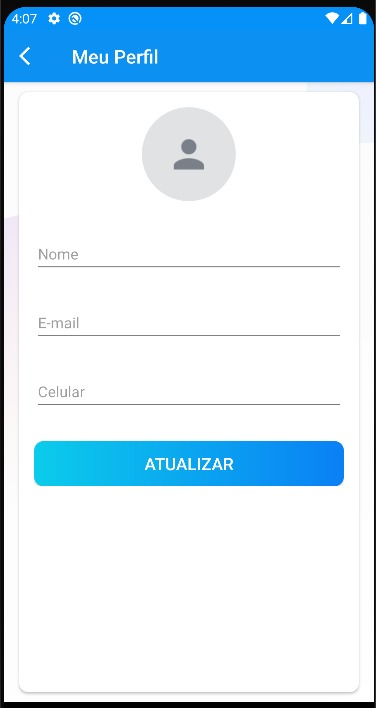

# Trecco - Simplicidade e comunicação

A proposta do projeto é desenvolver uma solução baseada no Trello, que mantém a simplicidade
característica da plataforma, ao mesmo passo que incrementar a ideia original ao oferecer melhor comunicação
entre os usuários através da implementação de um chat em tempo real.

# Membros do grupo

|Nome                          |RA      |Turma Mobile  |Turma PA |
|:----------------------------:|:------:|:------------:|:-------:|
|Gabriela Miranda Domingues    |190634  |CP110TIN3     |PA038TIN3|
|Guilherme Santini Sforza      |190605  |CP110TIN2     |PA038TIN3|
|Lívia Sayuri Chinem Moreno    |190374  |CP110TIN3     |PA038TIN1|
|Luiz Felipe Looze             |190906  |CP110TIN2     |PA038TIN3|
|Daniele dos Santos Rosa       |111706  |CP110TIN2     |PA038TIN1|

# Funcionalidades
- Sistema login automatico;
- Sistema de update de perfil do usuario;
- Sistema de boards e de cards tal como no Trello/jira;
- Chat em tempo real tal como no Whatsapp/Telegram;

# Telas

## Tela de cadastro
  

   
  

  
  

   
  

  
  

   
  

  
  

   
  

  
  

   
  

