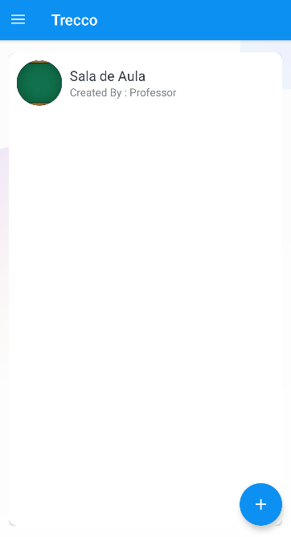
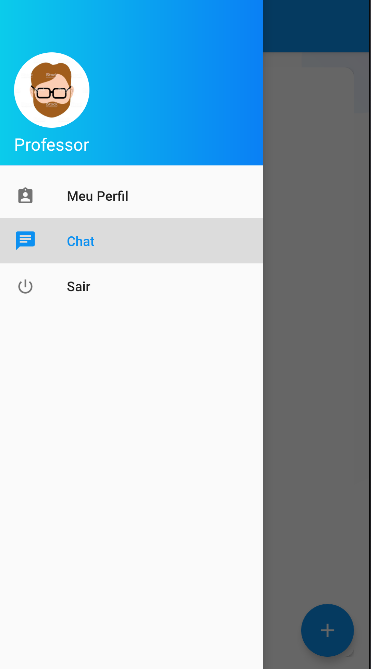
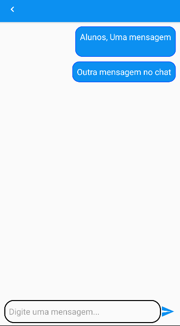
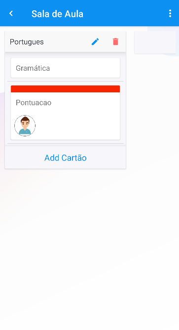
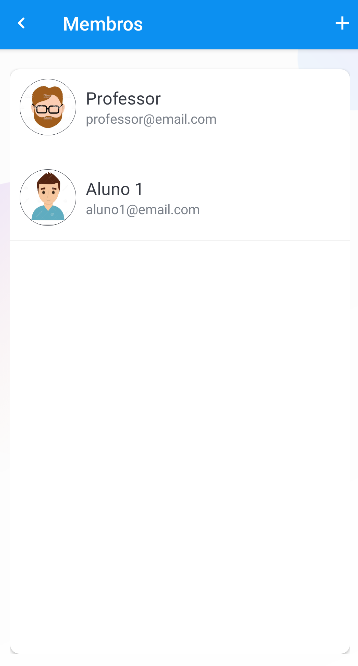
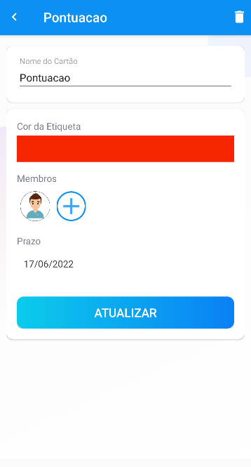

# Trecco - Simplicidade e comunicação

A proposta do projeto é desenvolver uma solução baseada no Trello, que mantém a simplicidade
característica da plataforma, ao mesmo passo que incrementar a ideia original ao oferecer melhor comunicação
entre os usuários através da implementação de um chat em tempo real.

# Membros do grupo

|Nome                          |RA      |Turma Mobile  |Turma PA |
|:----------------------------:|:------:|:------------:|:-------:|
|Gabriela Miranda Domingues    |190634  |CP110TIN3     |PA038TIN3|
|Guilherme Santini Sforza      |190605  |CP110TIN2     |PA038TIN3|
|Lívia Sayuri Chinem Moreno    |190374  |CP110TIN3     |PA038TIN1|
|Luiz Felipe Looze             |190906  |CP110TIN2     |PA038TIN3|
|Daniele dos Santos Rosa       |111706  |CP110TIN2     |PA038TIN1|

# Video de Apresentação:
## Youtube
- Acessar o link do youtube: https://youtu.be/aW0LNru9k0E

## Drive
- Ou se preferir para visualizar em melhor qualidade: https://drive.google.com/file/d/10oUu72h2KAp68C-sy7v70TWY7G1hqLBC/view?usp=sharing

# Funcionalidades
- Sistema login automatico;
- Sistema de update de perfil do usuario;
- Sistema de boards e de cards tal como no Trello/jira;
- Chat em tempo real tal como no Whatsapp/Telegram;

# Telas

## Tela Splash
  

   
  

## Tela Inicial
  

   
  

  
## Tela de cadastro
  

   
  

## Tela de Login
  

   
  

  
## Tela Principal
  

   
  

  
## Tela Barra de Navegação
  

   
  

  
## Tela de Chat

 

  
  
## Tela Meu Perfil
  

   
  
  
  
## Tela de Tarefas

 

## Tela de Membros

 

## Tela de Cards

 

# Instalação
## Instalação Direta
- Acessar o link: https://drive.google.com/drive/folders/1-y5I53LAp6354dvPe_FDtYOoNp7ExU0S?usp=sharing
- Baixar o arquivo: app-debug.apk
- Instalar
- Abrir

# Ou também:

## Antes de Rodar
Tenha certeza que o Android Studio esteja instalado. 
Se não estiver pode ser baixado aqui: https://developer.android.com/studio

## Android Studio
- Habilitar perfil de desenvolvedor no Smartphone;
- Conectar o Smartphone no computador via USB;
- No Android Studio, na parte de seleção de dispositivo, selecionar o Smartphone conectado;
- Selecionar opção de Run & Build.

## Repositório
- Na opção de código, selecione download ZIP;
- Extraia o arquivo;
- No Android Studio, abara a pasta do arquivo.

